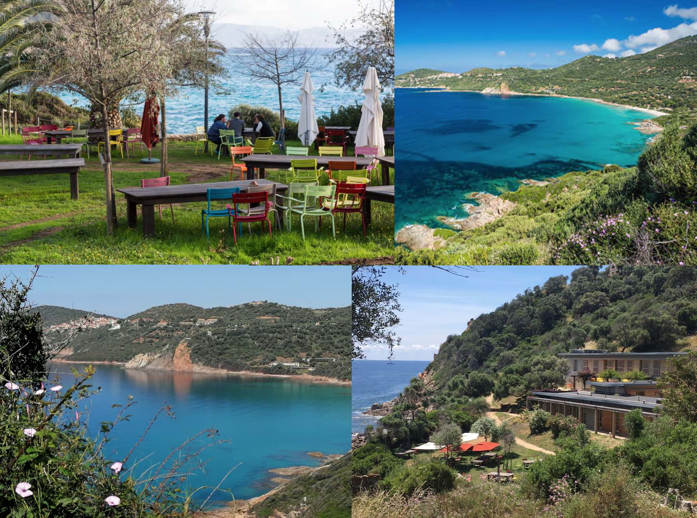

The past decades brought a revolution to machine learning: algorithms are now able to deal with tasks and amounts of data that seemed to be science fiction only a decade ago. The statistical physics community and the machine learning ones have long been connected and indeed many concepts and algorithms of machine learning have roots in physics, as testified by the [Physics Nobel prize to Giorgio Parisi in 2021](https://www.nobelprize.org/prizes/physics/2021/parisi/facts/) and the recent one to [John Hopfield and Geoffrey Hinton in 2024](https://www.nobelprize.org/prizes/physics/2024/press-release/). After [a wonderful event in 2018](https://krzakala.github.io/cargese.io/) and  [an equally amazing event in 2023](https://cargese2023.github.io/), we shall gather once again in Cargese in 2025, from August 5 to 15, and bring together researchers from machine learning & statistical physics to take full advantage of the strong link between the two fields to make further scientific progress. This school aims to bring together researchers from machine learning and statistical physics to train a new generation that will be able to take full advantage of the strong link between the two fields to make further scientific progress, but also to learn about the exiciting developenent in each other fields. The school will cover both theoretical aspect of machine learning and statistics. The format will be several (~10) 3h introductory lectures, and about twice as many contributed invited talks.

__Organisers:__  Florent Krzakala (EPFL, IdePhics Lab.), Lenka Zdeborova (EPFL, SPOC Lab.) 

# Schedule

TBA

# Lecturers

Peter Bartlett (Berkeley) 
Giulio Biroli (ENS) 
Michael Bronstein (Oxford) 
Bruno Loureiro (ENS Paris) 
Song Mei (Berkeley) 
Aaditya Ramdas (CMU) 
Philippe Rigollet (MIT) 
Daniel Roy (Vector Institute) 
Andrew Saxe (UCL) 

# Confirmed Invited speakers

Michael Albergo (Harvard) 
Gérard Ben Arous (NYU) 
Alex Damian (Princeton) 
Edgar Dobriban (U Penn) 
Ivan Dokmanic (Basel)  
Karolina Dziugaite (Google) 
Federica Gerace (Bologna) 
Brice Huang (Harvard) 
Aukosh Jagannath (Waterloo)   
Jason Lee (Princeton) 
Alessandro Liao (SISSA) 
Marc Mezard (Bocconi) 
Francesca Mignacco (Princeton) 
Courtney Paquette (McGill University) 
Will Perkins (Georgia Tech)            
Eric Vanden-Eijnden (NYU) 
Leila Wehbe (CMU)  
Maxim Raginsky (Urbana-Champaign) 
Pan Zhang (ITPC) 

# Registration

<!--- Applications will be open in late 2025 -->

<!-- The selection of the participants will take place in the days following the deadline (31st March 2025).  -->

# Practical informations

The workshop cost is 1100 euros per participant covering accommodation, lunches and breakfasts. 

While participant can arrive on 4/8 and leave on 16/8, the conference will take place between 5/8 and 15/8.

More information can be found on [the institute webpage](https://iesc.universita.corsica/?lang=en).

<!--- The poster of the event can be downloaded [here](Affiche-Krzakala-2023.pdf) -->

# Contacts

For any question, write [cargese2025@gmail.com](mailto:cargese2025@gmail.com).

<!-- # Organization Committee:
Florent Krzakala (EPFL, IdePhics Lab.), Lenka Zdeborova (EPFL, SPOC Lab.)
           -->
<!-- <a href="https://twitter.com/intent/tweet?button_hashtag=cargese2025&ref_src=twsrc%5Etfw" class="twitter-hashtag-button" data-show-count="false">Tweet #cargese2023</a> -->

### Sponsors

